# Apache Kafka — Complete Practical Guide

## What is Kafka?

Apache Kafka is a **distributed event streaming platform** used for:

* Real-time data pipelines
* Event-driven architectures
* Log aggregation
* Analytics pipelines
* Messaging between microservices
* Stream processing
* Pub/Sub systems

Kafka is designed for:

* High throughput
* Horizontal scalability
* Fault tolerance
* Distributed processing
* Durable event storage

Instead of services directly calling each other synchronously:

```text
Service A -> HTTP -> Service B
```

Kafka allows services to communicate asynchronously:

```text
Service A -> Kafka -> Service B
```

---

# Kafka Core Idea

A producer sends events/messages to Kafka.
Kafka stores them.
Consumers read them independently.

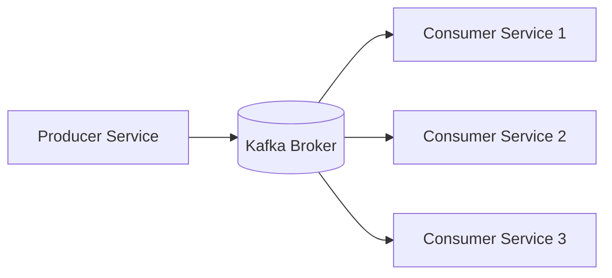

---

# Real World Use Cases

## 1. Netflix

Every:

* play
* pause
* seek
* recommendation click
* subtitle change
* watch duration

is sent as Kafka events.

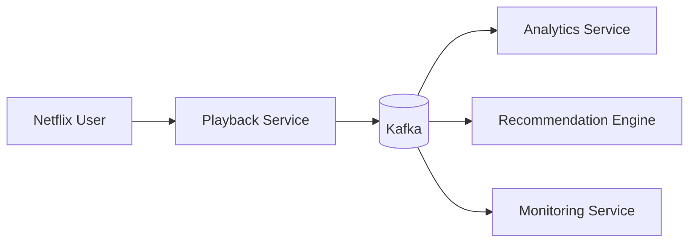

---

## 2. Uber

Kafka handles:

* driver locations
* ride requests
* payment events
* trip updates
* notifications

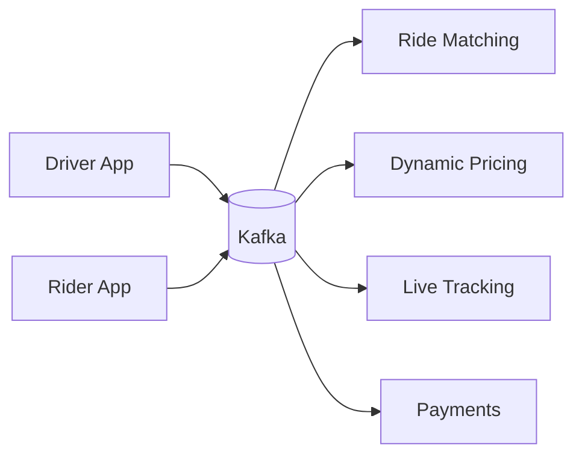

---

## 3. Banking Systems

Kafka is heavily used for:

* transaction processing
* fraud detection
* audit logging
* notifications
* account updates

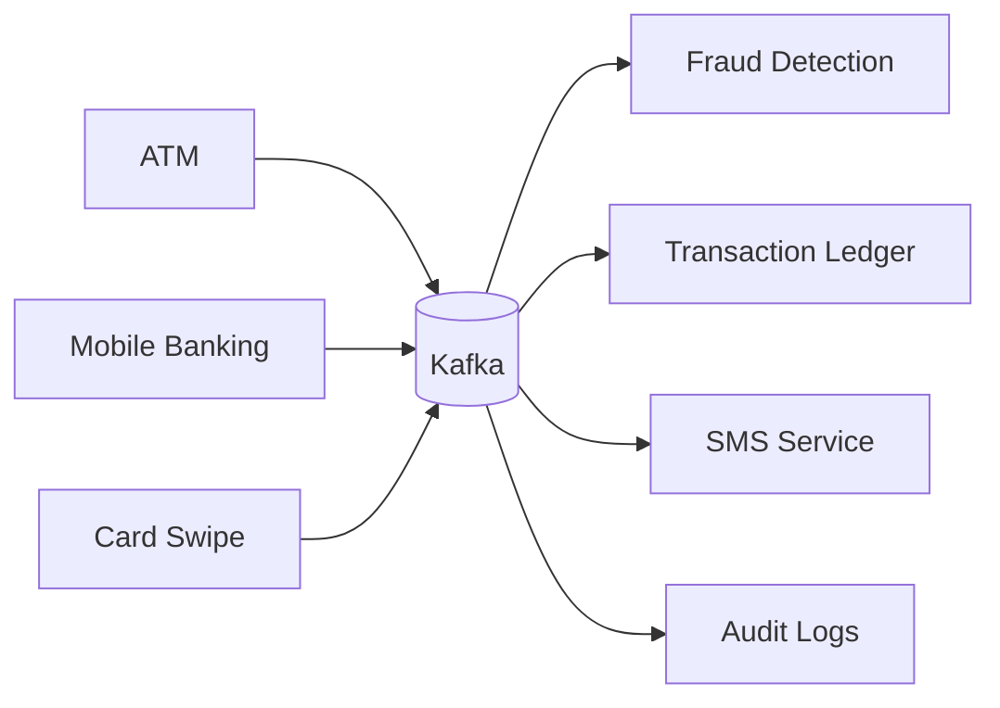

---

# Kafka Terminology

## 1. Message / Record / Event

A Kafka message is a piece of data.

Example:

```json
{
  "userId": 101,
  "action": "LOGIN",
  "timestamp": "2026-05-09T10:00:00"
}
```

Messages can be:

* JSON
* XML
* Avro
* Protobuf
* CSV lines
* Plain text
* Binary data
* Images
* Logs
* Metrics
* Clickstream data
* Sensor data

A Kafka record contains:

* key
* value
* timestamp
* offset
* headers

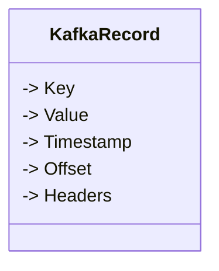

Example:
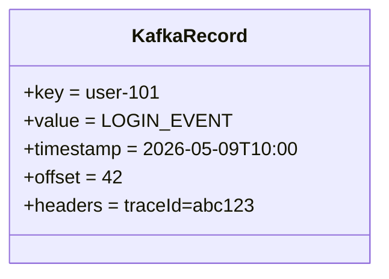
it means:
```
User 101 performed a LOGIN event
at 2026-05-09T10:00
```

---

## 2. Producer

A Producer sends messages to Kafka.

Examples:

* Spring Boot app
* Python service
* Payment system
* Sensor
* Mobile app backend

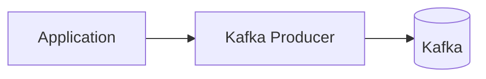

Producer responsibilities:

* chooses topic
* serializes data
* optionally chooses partition
* retries on failures
* batching
* compression

---

## 3. Consumer

A Consumer reads messages from Kafka.

Examples:

* analytics service
* notification service
* fraud detector
* recommendation engine

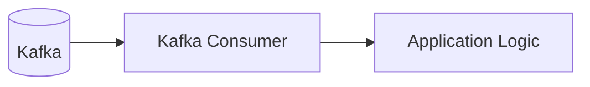

Consumers pull data.
Kafka does not push data.

---

## 4. Broker

A Kafka server is called a Broker.

A broker:

* stores messages
* handles producers
* handles consumers
* replicates data
* manages partitions

Single broker setup:

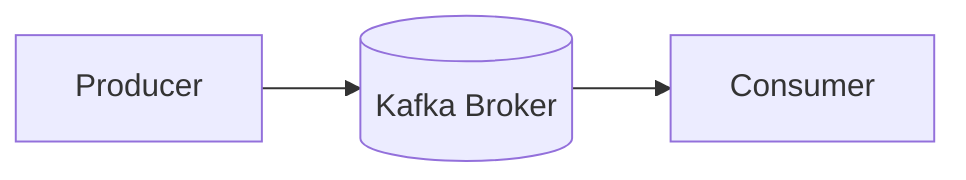

Production systems use multiple brokers.

---

## 5. Topic

A Topic is like a category or stream.
It's a logical grouping of partitions.

Examples:

* orders
* payments
* user-logins
* ride-events
* inventory-updates

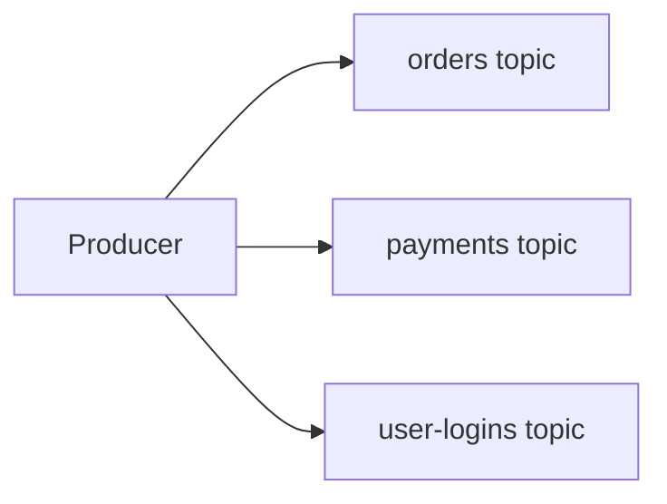

Topics are append-only logs.

Messages are continuously appended.

---

## 6. Partition

Fundamental Unit of parallelism.    
Topics are split into partitions.   
This is where the messages actually live in like a Queue.

Partitions enable:

* parallelism
* scalability
* distributed storage
* load balancing

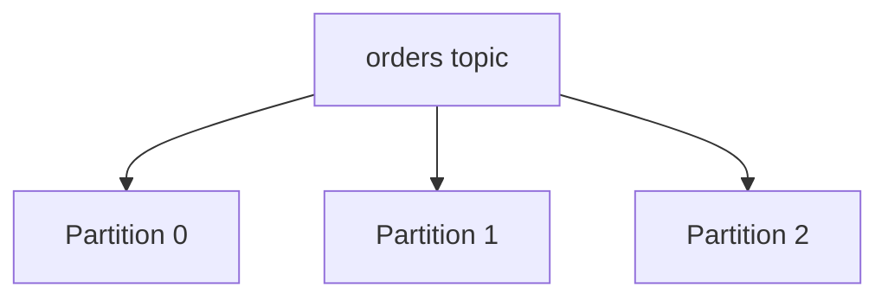

Each partition is ordered independently.

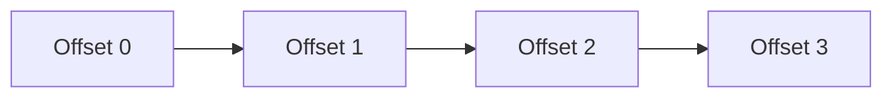

---

## 7. Offset

Every message inside a partition gets an offset.

Offsets are unique ONLY inside a partition.

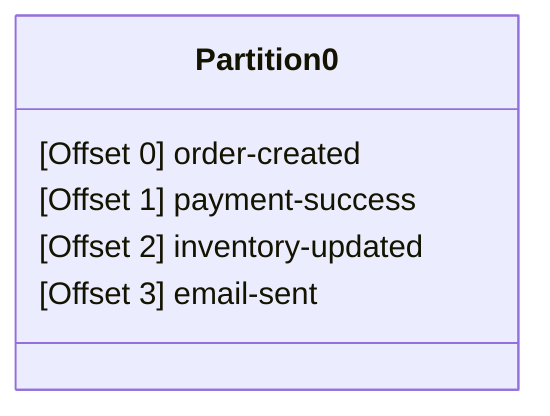

Consumers track offsets to know what they already consumed.

---

## 8. Consumer Groups

Consumer groups allow scaling consumers.

Inside a consumer group:

* one partition -> one consumer
* partitions distributed among consumers

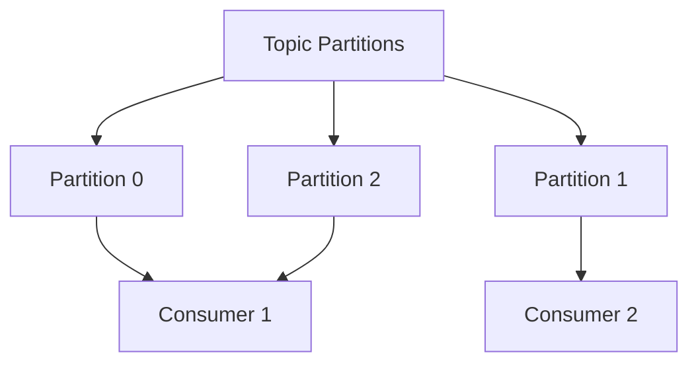

If a consumer dies:

Kafka rebalances partitions.

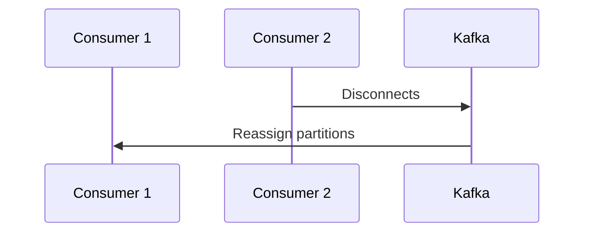

---

## 9. Pub/Sub

Publish/Subscribe means:

* Producers publish events
* Multiple consumers subscribe

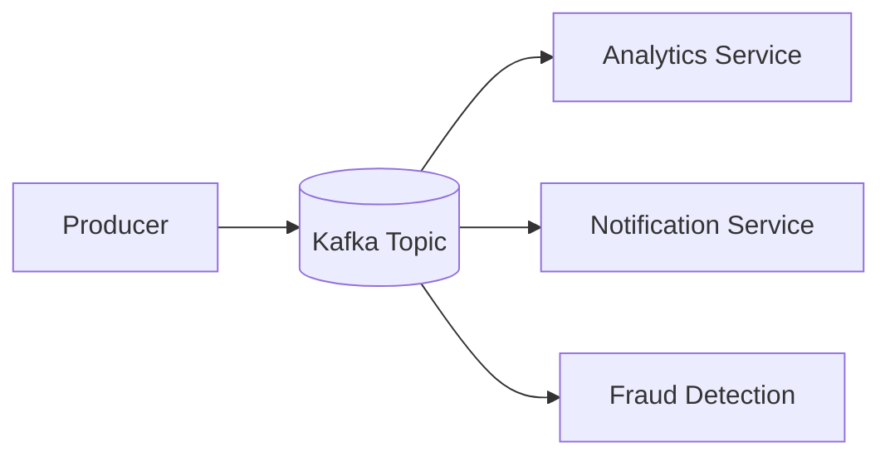

---

## 10. Replication

Kafka replicates partitions across brokers.

Purpose:

* fault tolerance
* durability
* high availability

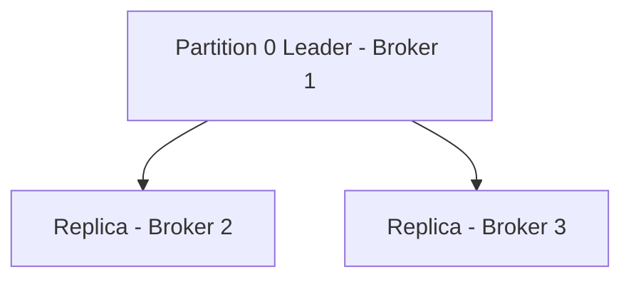

If Broker 1 dies:

One replica becomes leader.

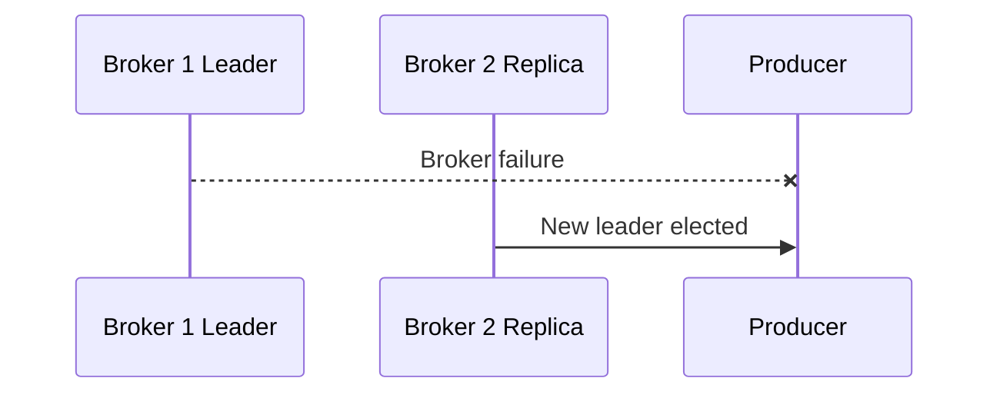

---

## 11. Replication Factor

Replication factor defines:

How many copies of a partition exist.

Example:

```text
Replication Factor = 3
```

Means:

* 1 leader
* 2 replicas

Total copies = 3

---

## 12. Leader and Followers

Each partition has:

* one leader
* multiple followers

All reads/writes go through leader.

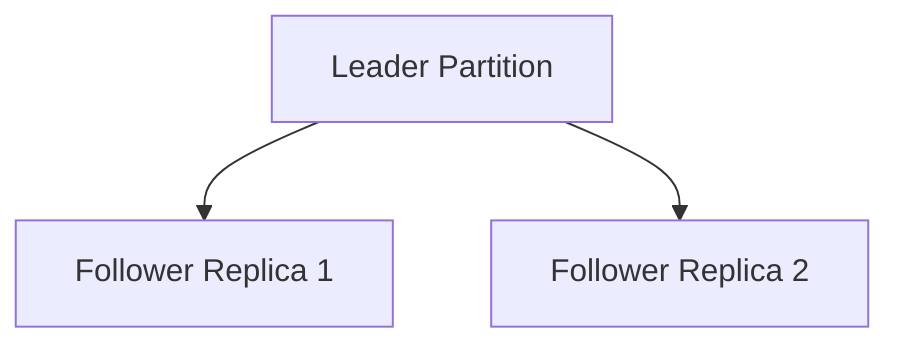
---

## 13. Message Acknowledgement (Offset commit)

Kafka maintains some kind of ledger to tracks messages - which messages are delivered to which consumer etc.

Kafka updates the offset (as part of offset tracking) only when it receives an acknowledgement from the consumer.

**Acknowledgment** is an application concept and **Offset commit** is the Kafka operation behind it.

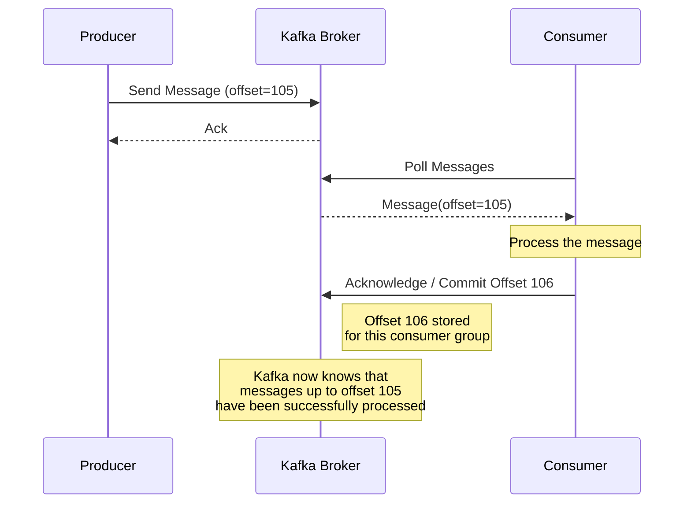

---

# Multi Broker Kafka Cluster

```mermaid
flowchart LR
    subgraph Broker1
        P0[Partition 0 Leader]
        P1R[Partition 1 Replica]
    end

    subgraph Broker2
        P1[Partition 1 Leader]
        P2R[Partition 2 Replica]
    end

    subgraph Broker3
        P2[Partition 2 Leader]
        P0R[Partition 0 Replica]
    end
```

This distributes:

* storage
* reads
* writes
* CPU load

---

## process.roles

Every node here is either:
1. Broker (Read + Write), 
2. Controller (Manages the cluster) or
3. Broker + Controller (Brokers eligible to be a Controller)

- Only one active controller exists at any given time.

---

# How Partitioning Works

Producer chooses partition using:

* round robin
* explicit partition
* message key hash

```mermaid
flowchart LR
    P[Producer]

    P --> H[Hash userId]

    H --> P0[Partition 0]
    H --> P1[Partition 1]
    H --> P2[Partition 2]
```

Same key -> same partition.

This preserves ordering.

---

# Example Event Flow

```mermaid
sequenceDiagram
    participant User
    participant Backend
    participant Producer
    participant Kafka
    participant Consumer
    participant Database

    User->>Backend: Place Order
    Backend->>Producer: Create Order Event
    Producer->>Kafka: Send Event
    Kafka->>Consumer: Deliver Event
    Consumer->>Database: Store Order
```

---

# Legacy Kafka Architecture (ZooKeeper)

Older Kafka versions required ZooKeeper.

ZooKeeper handled:

* broker metadata
* leader election
* cluster coordination
* controller election
* configs

---

# Legacy Kafka Architecture Diagram

```mermaid
flowchart TD
    ZK[(ZooKeeper)]

    B1[(Broker 1)]
    B2[(Broker 2)]
    B3[(Broker 3)]

    B1 --> ZK
    B2 --> ZK
    B3 --> ZK

    Producer --> B1
    Consumer --> B2
```

---

# Problems With ZooKeeper Architecture

Issues:

* operational complexity
* separate cluster to manage
* scaling difficulties
* metadata bottlenecks
* harder deployments
* more moving parts

You had to manage:

* Kafka cluster
* ZooKeeper cluster

---

# New Kafka Architecture (KRaft)

Modern Kafka uses:

```text
KRaft = Kafka Raft Metadata Mode
```

ZooKeeper is removed.

Kafka manages metadata internally.

---

# KRaft Architecture Diagram

```mermaid
flowchart TD
    C1[Controller Node 1]
    C2[Controller Node 2]
    C3[Controller Node 3]

    B1[(Broker 1)]
    B2[(Broker 2)]
    B3[(Broker 3)]

    C1 --> B1
    C1 --> B2
    C1 --> B3

    C2 --> B1
    C2 --> B2
    C2 --> B3

    C3 --> B1
    C3 --> B2
    C3 --> B3
```

---

# KRaft Metadata Quorum

KRaft uses Raft consensus.

Controllers maintain metadata quorum.

```mermaid
flowchart LR
    C1[Controller 1 Leader]
    C2[Controller 2]
    C3[Controller 3]

    C1 --> C2
    C1 --> C3
```

---

# Legacy vs KRaft

| Feature                | ZooKeeper Kafka | KRaft Kafka    |
| ---------------------- | --------------- | -------------- |
| ZooKeeper Required     | Yes             | No             |
| Metadata Storage       | ZooKeeper       | Kafka Internal |
| Simpler Setup          | No              | Yes            |
| Scalability            | Lower           | Better         |
| Operational Complexity | High            | Lower          |
| Recommended Today      | No              | Yes            |

---

# Running Kafka Using Docker (KRaft)

No local install needed.

---

# Start Kafka Container

```bash
docker run -d \
  --name kafka \
  -p 9092:9092 \
  apache/kafka:latest
```

or use Docker Compose + included [docker compose](kafka-container.yaml) file:
```bash
docker compose -f kafka-container.yaml up
```

Verify:

```bash
docker ps
```

---

# Kafka Container Architecture

```mermaid
flowchart LR
    Terminal[Linux/Mac Terminal]

    Docker[(Docker Engine)]

    Kafka[(Kafka Container)]

    Terminal --> Docker --> Kafka
```

---

# Enter Kafka Container

```bash
docker exec -it kafka bash
```

---

# Kafka CLI Location

Usually:

```bash
/opt/kafka/bin
```

---

# List Topics

```bash
/opt/kafka/bin/kafka-topics.sh \
  --bootstrap-server localhost:9092 \
  --list
```

---

# Create Topic

```bash
/opt/kafka/bin/kafka-topics.sh \
  --bootstrap-server localhost:9092 \
  --create \
  --topic orders \
  --partitions 3 \
  --replication-factor 1
```

---

# Default Topic Properties

If not specified:

| Property           | Default        |
| ------------------ | -------------- |
| partitions         | 1              |
| replication factor | broker default |
| retention.ms       | 7 days         |
| cleanup.policy     | delete         |

---

# Describe Topic

```bash
/opt/kafka/bin/kafka-topics.sh \
  --bootstrap-server localhost:9092 \
  --describe \
  --topic orders
```

Example output:

```text
Topic: orders
PartitionCount: 3
ReplicationFactor: 1
```

---

# Start Console Producer

```bash
/opt/kafka/bin/kafka-console-producer.sh \
  --bootstrap-server localhost:9092 \
  --topic orders
```

By default the key of messages is ```null```.

To produce messages using a key:
```bash
/opt/kafka/bin/kafka-console-producer.sh \
  --bootstrap-server localhost:9092 \
  --topic orders \
  --property parse.key=true
  --property key.separator=:
```
(uses the mentioned key separator to parse the key)

Now type messages:

```text
order-1
order-2
order-3
```

---

# Producer Flow

```mermaid
flowchart LR
    ConsoleProducer[Console Producer]
    Kafka[(Kafka Broker)]
    Topic[orders topic]

    ConsoleProducer --> Kafka --> Topic
```

---

# Start Console Consumer

```bash
/opt/kafka/bin/kafka-console-consumer.sh \
  --bootstrap-server localhost:9092 \
  --topic orders
```

---

# Consume From Beginning

```bash
/opt/kafka/bin/kafka-console-consumer.sh \
  --bootstrap-server localhost:9092 \
  --topic orders \
  --from-beginning
```

---

# Consume With Consumer Group

```bash
/opt/kafka/bin/kafka-console-consumer.sh \
  --bootstrap-server localhost:9092 \
  --topic orders \
  --group analytics-group
```

---

# Push CSV File Into Kafka

Example CSV:

```text
id,name,amount
1,alice,100
2,bob,200
```

Pipe into producer:

```bash
cat data.csv | \
/opt/kafka/bin/kafka-console-producer.sh \
  --broker-list localhost:9092 \
  --topic orders
```

Each line becomes a Kafka message.

---


# View Consumer Groups

```bash
/opt/kafka/bin/kafka-consumer-groups.sh \
  --bootstrap-server localhost:9092 \
  --list
```

---

# Describe Consumer Group

```bash
/opt/kafka/bin/kafka-consumer-groups.sh \
  --bootstrap-server localhost:9092 \
  --describe \
  --group analytics-group
```

Shows:

* lag
* assigned partitions
* offsets
* consumers

---

# View Load Distribution

```mermaid
flowchart LR
    P0[Partition 0] --> B1[Broker 1]
    P1[Partition 1] --> B2[Broker 2]
    P2[Partition 2] --> B3[Broker 3]
```

And:

```bash
/opt/kafka/bin/kafka-topics.sh \
  --bootstrap-server localhost:9092 \
  --describe \
  --topic orders
```

---

# Clear Messages In Topic

Kafka does not support direct truncate.

Common approaches:

## Method 1 — Delete and recreate topic

```bash
/opt/kafka/bin/kafka-topics.sh \
  --bootstrap-server localhost:9092 \
  --delete \
  --topic orders
```

Recreate topic again.

---

## Method 2 — Reduce retention temporarily

```bash
/opt/kafka/bin/kafka-configs.sh \
  --bootstrap-server localhost:9092 \
  --entity-type topics \
  --entity-name orders \
  --alter \
  --add-config retention.ms=1000
```

Wait.

Kafka deletes old messages.

Restore retention later.

---

# Delete Topic

```bash
/opt/kafka/bin/kafka-topics.sh \
  --bootstrap-server localhost:9092 \
  --delete \
  --topic orders
```

---

# Message Retention

Kafka retains messages for a duration.

Default:

```text
7 days
```

---

# Set Retention Time

Example:

Keep messages for 1 hour.

```bash
/opt/kafka/bin/kafka-configs.sh \
  --bootstrap-server localhost:9092 \
  --entity-type topics \
  --entity-name orders \
  --alter \
  --add-config retention.ms=3600000
```

---

# Retention Flow

```mermaid
timeline
    title Kafka Message Retention

    section Message Lifecycle
        Message Produced : T0
        Stored In Partition : T1
        Retention Period Ends : T2
        Kafka Deletes Message : T3
```

---

# Limit Topic Size / Keep Latest Messages Only

Kafka can remove old messages based on:

* total size
* retention time
* log compaction

---

# Keep Only Latest N MB

Example:

```bash
/opt/kafka/bin/kafka-configs.sh \
  --bootstrap-server localhost:9092 \
  --entity-type topics \
  --entity-name orders \
  --alter \
  --add-config retention.bytes=104857600
```

This keeps only:

```text
100 MB
```

of latest data.

Old data removed automatically.

---

# Log Compaction

Kafka can also retain only latest value per key.

Useful for:

* user profiles
* account balances
* latest state systems

```mermaid
flowchart TD

    subgraph Kafka_Log
        O1["Offset 0 -> ❌ user1 = Alice"]
        O2["Offset 1 -> ❌ user1 = Alice Smith"]
        O3["Offset 2 -> ✅ user1 = Alice S"]
    end

    FINAL["Only latest value kept after compaction"]

    O3 --> FINAL
```

Enable:

```bash
cleanup.policy=compact
```

---

# Persistence

Kafka persists messages to disk.

Even if consumers are offline:

Messages remain available.

```mermaid
flowchart LR
    Producer --> Kafka[(Disk Storage)]

    Kafka --> Consumer1
    Kafka --> Consumer2
```

Kafka does NOT store data in a traditional DB like: MySQL, PostgreSQL or MongoDB

Kafka itself IS the storage layer.

It stores messages directly on disk as append-only logs.

```mermaid
flowchart LR
    
    Broker --> PartitionLog["Partition Log Files (.log)"]

    PartitionLog --> SSD["Disk / SSD"]
```
Each partition is literally stored as log segment files on disk.

Example:
```bash
/tmp/kraft-combined-logs/orders-0/
```
Inside:
```bash
00000000000000000000.log
00000000000000000000.index
00000000000000000000.timeindex
```
---

# Kafka Delivery Semantics

Kafka supports:

| Type          | Meaning               |
| ------------- | --------------------- |
| At Most Once  | Possible data loss    |
| At Least Once | Possible duplicates   |
| Exactly Once  | No duplicates/no loss |

---

# Why Kafka Is Powerful

Kafka combines:

* messaging system
* durable storage
* distributed log
* event streaming platform
* pub/sub architecture
* replay capability

---

# Kafka vs Traditional Queue

| Feature            | Traditional Queue | Kafka     |
| ------------------ | ----------------- | --------- |
| Replay Messages    | Usually No        | Yes       |
| Distributed        | Limited           | Yes       |
| High Throughput    | Lower             | Very High |
| Persistent Storage | Sometimes         | Yes       |
| Partitioning       | Limited           | Native    |
| Stream Processing  | Limited           | Strong    |

---

# KafkIO GUI

KafkIO is a good GUI client for:

* viewing topics
* browsing messages
* viewing partitions
* inspecting consumer groups
* producing test messages
* cluster monitoring

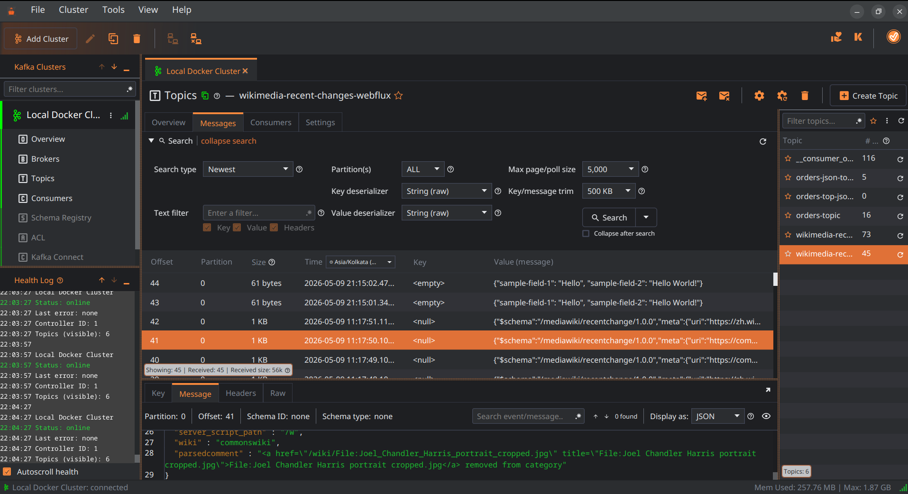

[Download it here](https://kafkio.com/download)

Useful alternative GUIs:

* AKHQ
* Kafka UI
* Conduktor
* Offset Explorer

---

# Full Architecture Viz

```mermaid
flowchart LR
    subgraph Producers
        P1[Order Service]
        P2[Payment Service]
        P3[User Service]
    end

    subgraph Kafka Cluster
        B1[(Broker 1)]
        B2[(Broker 2)]
        B3[(Broker 3)]
    end

    subgraph Consumers
        C1[Analytics]
        C2[Fraud Detection]
        C3[Notifications]
        C4[Warehouse]
    end

    P1 --> B1
    P2 --> B2
    P3 --> B3

    B1 --> C1
    B2 --> C2
    B3 --> C3
    B1 --> C4
```

---

# Kafka Multi-Broker + Multi-Partition Replication & Fetching

Refer to and use the included [docker compose yaml](multi-broker-kafka.yaml) file to run a Kafka Cluster with 3 brokers locally. 

## Topic Setup

Example:

```text
Topic: orders

Partitions = 3
Replication Factor = 2
Brokers = 3
```

Kafka distributes partition replicas across brokers.

Example layout:

| Partition | Leader   | Follower |
| --------- | -------- | -------- |
| P0        | Broker 1 | Broker 2 |
| P1        | Broker 2 | Broker 3 |
| P2        | Broker 3 | Broker 1 |

---

## Cluster Layout

```mermaid
flowchart LR

    subgraph B1["Broker 1"]

        P0L["P0 Leader"]
        P2F["P2 Follower"]

    end

    subgraph B2["Broker 2"]

        P1L["P1 Leader"]
        P0F["P0 Follower"]

    end

    subgraph B3["Broker 3"]

        P2L["P2 Leader"]
        P1F["P1 Follower"]

    end
```

---

## Important Concepts

Each partition has:

* ONE leader
* ZERO or more followers

Kafka replication happens:

* per partition
* independently
* continuously

Followers DO NOT receive pushed data.

Instead:

> Followers continuously FETCH data from leaders.

Kafka replication is pull-based.

---

## Producer Write Flow

Producers write ONLY to partition leaders.

```mermaid
flowchart LR

    PRODUCER["Producer"]

    P0["P0 Leader<br/>Broker 1"]
    P1["P1 Leader<br/>Broker 2"]
    P2["P2 Leader<br/>Broker 3"]

    PRODUCER -->|"Order-101"| P0
    PRODUCER -->|"Order-102"| P1
    PRODUCER -->|"Order-103"| P2
```

---

## Replication Flow

Followers continuously fetch new records from their respective leaders.

```mermaid
flowchart TB

    subgraph Broker1

        P0L["P0 Leader"]
        P2F["P2 Follower"]

    end

    subgraph Broker2

        P1L["P1 Leader"]
        P0F["P0 Follower"]

    end

    subgraph Broker3

        P2L["P2 Leader"]
        P1F["P1 Follower"]

    end

    P0F -->|"Fetch P0 Data"| P0L
    P1F -->|"Fetch P1 Data"| P1L
    P2F -->|"Fetch P2 Data"| P2L
```

---

## Internal Mental Model

Followers are basically saying:

```text
"Yo leader, gimme everything after offset X"
```

Leader responds with:

* new records
* latest offsets

Followers append them locally.

---

## Write + Replication Sequence

Example for Partition P0:

```mermaid
sequenceDiagram

    participant PROD as Producer
    participant B1 as Broker 1 (P0 Leader)
    participant B2 as Broker 2 (P0 Follower)

    PROD->>B1: Produce Order Created
    B1->>B1: Append to P0 log

    loop Continuous Replication Fetch
        B2->>B1: Fetch from offset 220
        B1-->>B2: New records
        B2->>B2: Append to replica log
    end
```

---

## Replica Logs

After replication:

```text
Broker 1
P0 Leader     [0 1 2 3]

Broker 2
P0 Follower   [0 1 2 3]
```

Leader and follower replicas contain the same partition data.

---

## Consumer Fetching

Consumers ALSO fetch.

Consumers read ONLY from partition leaders.

```mermaid
flowchart LR

    CONSUMERS["Consumer Group"]

    P0["P0 Leader<br/>Broker 1"]
    P1["P1 Leader<br/>Broker 2"]
    P2["P2 Leader<br/>Broker 3"]

    CONSUMERS -->|"Fetch P0"| P0
    CONSUMERS -->|"Fetch P1"| P1
    CONSUMERS -->|"Fetch P2"| P2
```

---

## Consumer Fetch Sequence

```mermaid
sequenceDiagram

    participant C as Consumer
    participant L as Broker 1 (P0 Leader)

    C->>L: Fetch from offset 200
    L-->>C: Messages 201-220
```

---

## Parallelism

Multiple partitions allow parallel consumption.

```mermaid
flowchart LR

    C1["Consumer 1"]
    C2["Consumer 2"]
    C3["Consumer 3"]

    P0["Partition 0"]
    P1["Partition 1"]
    P2["Partition 2"]

    C1 --> P0
    C2 --> P1
    C3 --> P2
```

This is why Kafka scales:

* more partitions
* more parallel consumers
* more throughput

---

## Full Cluster Data Flow

```mermaid
flowchart TB

    PRODUCER["Producer"]

    subgraph B1["Broker 1"]

        P0L["P0 Leader"]
        P2F["P2 Follower"]

    end

    subgraph B2["Broker 2"]

        P1L["P1 Leader"]
        P0F["P0 Follower"]

    end

    subgraph B3["Broker 3"]

        P2L["P2 Leader"]
        P1F["P1 Follower"]

    end

    CONSUMERS["Consumer Group"]

    PRODUCER --> P0L
    PRODUCER --> P1L
    PRODUCER --> P2L

    P0F -->|"Fetch P0"| P0L
    P1F -->|"Fetch P1"| P1L
    P2F -->|"Fetch P2"| P2L

    CONSUMERS --> P0L
    CONSUMERS --> P1L
    CONSUMERS --> P2L
```

---

## Broker Failure & Leader Election

Suppose Broker 1 crashes.

Before:

```text
P0 Leader -> Broker 1
P0 Follower -> Broker 2
```

After election:

```text
P0 Leader -> Broker 2
```

Now:

* producers write to Broker 2
* consumers read from Broker 2
* replication continues normally

---

## Failover Visualization

```mermaid
flowchart LR
    subgraph AFTER

        NB2["Broker 2<br/>NEW P0 Leader"]
    end

    subgraph BEFORE

        B1["Broker 1<br/>P0 Leader -> CRASH"]
        B2["Broker 2<br/>P0 Follower"]
    end
```

---

## In-Sync Replicas (ISR)

Kafka tracks replicas that are fully caught up.

Example:

```text
ISR = [Broker1, Broker2]
```

Only ISR replicas are eligible to become leaders.

---

## Most Important Kafka Truth

Kafka replication is NOT:

```text
Leader PUSHES data to followers
```

Kafka replication IS:

```text
Followers FETCH data from leaders
```
---

## Most Important Mental Model
```
Topic
 └── Partitions
      └── Replicas
           ├── Leader
           └── Followers
```

Kafka replication and fetching happen:
- per partition
- per replica
- independently
- continuously

---

# Summary

Kafka is:

* distributed
* fault tolerant
* scalable
* durable
* high throughput
* event-driven

Core concepts:

* Producers send events
* Topics store streams
* Partitions enable scaling
* Brokers store data
* Consumers read data
* Consumer groups scale consumption
* Replication provides fault tolerance
* KRaft replaces ZooKeeper

Kafka powers:

* Netflix
* Uber
* LinkedIn
* banking systems
* IoT systems
* analytics pipelines
* microservice communication
* real-time streaming architectures
